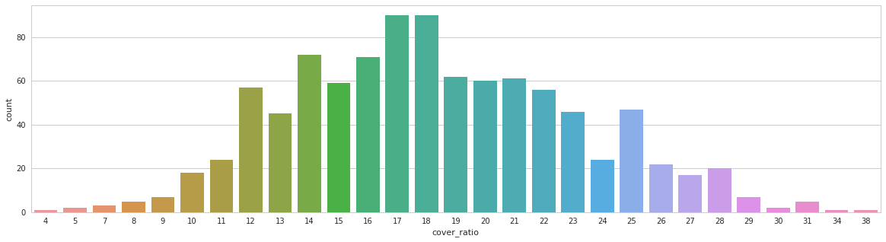
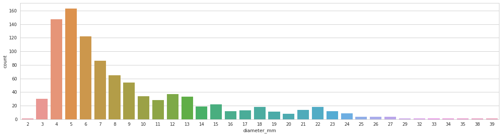
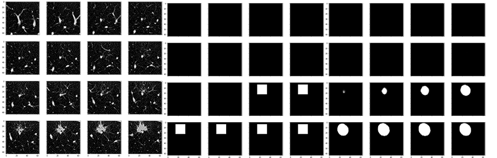
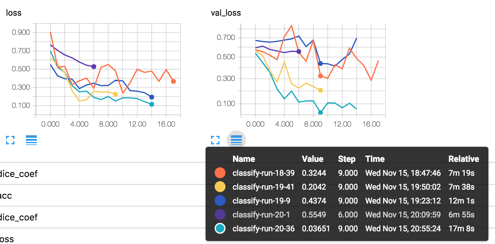
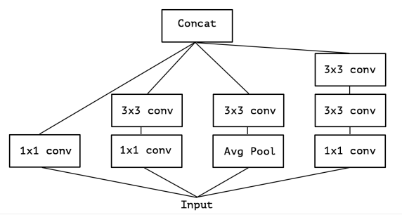
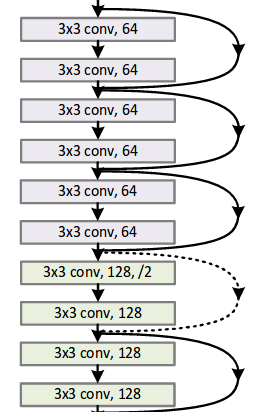
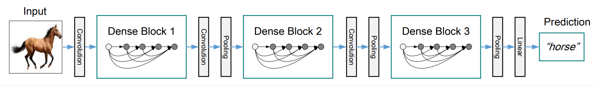
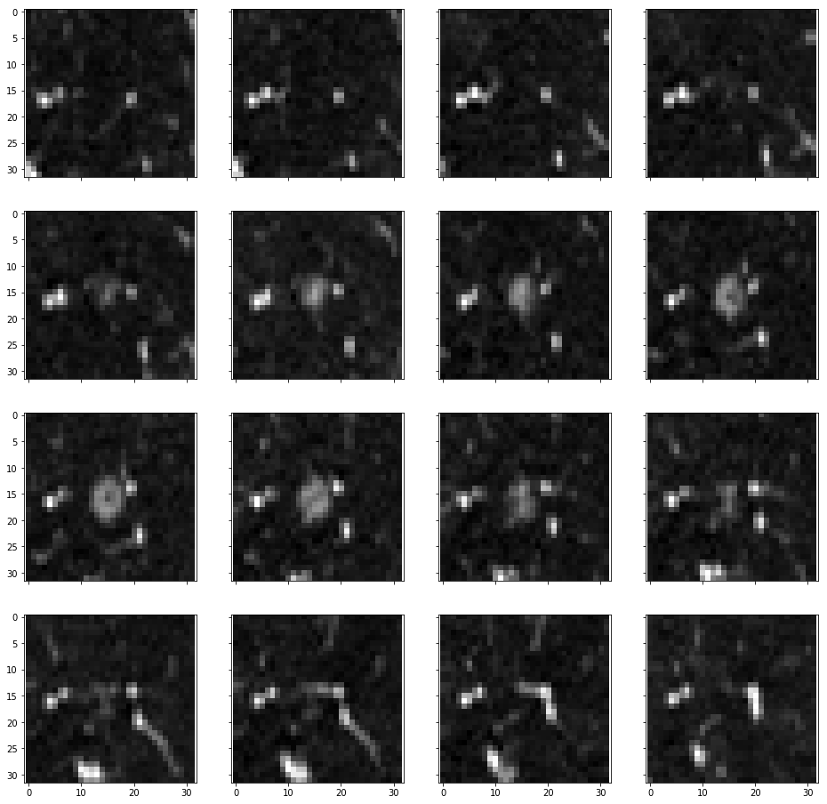

# 阿里云天池医疗大赛·肺结节检测

## Features

- **3D** Segmentation & Classification with Keras
- Fine **preprocessing** with scikit-image
- Fine **visualization** for clarification
- Modified UNet for **segmentation**
- Modified VGG/Inception/ResNet/DenseNet for **classification ensemble**
- Fine **hyperparameter** tunning with both models and training process.

## Code Hierarchy

```
- config.py # good practice to centralize hyper parameters

- preprocess.py # Step 1, preprocess, store numpy/meta 'cache' at ./preprocess/

- train_segmentation.py # Step 2, segmentation with UNet Model
- model_UNet.py # UNet model definition

- train_classificaion.py # Step 3, classificaiton with VGG/Inception/ResNet/DenseNet
- model_VGG.py # VGG model definition
- model_Inception.py # Inception model definition
- model_ResNet.py # ResNet model definition
- model_DenseNet.py # DenseNet model definition

- generators.py # generator for segmentation & classificaiton models
- visual_utils.py # 3D visual tools

- dataset/ # dataset, changed in config.py
- preprocess/ # 'cache' preprocessed numpy/meta data, changed in config.py

- train_ipynbs # training process notebooks
```

## Preprocess

- use `SimpleITK` to read CT files, process, and store into cache with numpy arrays
- process with `scikit-image` lib, try lots of parameters for best cutting
    - binarized
    - clear-board
    - label
    - regions
    - closing
    - dilation
- collect all meta information(seriesuid, shape, file_path, origin, spacing, coordinates, cover_ratio, etc.) and store in **ONE** cache file for fast training init.
- see preprocessing in `/train_ipynbs/preprocess.ipynb` file

Distribution of the lung part takes on a whole CT.



Tumor size distribution



## Segmentation

- A **simplified and full UNet** both tested.
- **`dice_coef_loss`** as loss function.
- Periodically evaluate model with **lots of metrics**, which helps a lot to understand the model.
- 30% of negative sample, which has no tumor, for generalization.
- Due to memory limitation, 16 batch size used.



## Classification

### VGG

- A simplified and full VGG model both tested. Use simplified VGG as baseline.



Pictures tells that: **hyperparameter tunning really matters**.

### Inception

- A simplified Inception-module based network, with each block has 4-5 different type of conv.
    - 1\*1\*1 **depth-size seperable conv**
    - 1\*1\*1 **depth-size seperable conv**, then 3\*3\*3 conv_bn_relu
    - 1\*1\*1 **depth-size seperable conv**, then 2 3\*3\*3 conv_bn_relu
    - AveragePooling3D, then 1\*1\*1 **depth-size seperable conv**
    - (optional in config) 1\*1\*1 **depth-size seperable conv**, and (5, 1, 1), (1, 5, 1), (1, 1, 5) **spatial separable convolution**
    - Concatenate above.



### ResNet

- use `bottleneck` block instead of `basic_block` for implementation.
- A `bottleneck` **residual block** consists of:
    - (1, 1, 1) conv_bn_relu
    - (3, 3, 3) conv_bn_relu
    - (1, 1, 1) conv_bn_relu
    - (optional in config) kernel_size=(3, 3, 3), strides=(2, 2, 2) conv_bn_relu for compression.
    - **Add(not Concatenate)** with input
- Leave `RESNET_BLOCKS` as config to tune



### DenseNet

- `DenseNet` draws tons of experience from origin paper. [https://arxiv.org/abs/1608.06993](https://arxiv.org/abs/1608.06993)
    - 3 dense\_block with 5 bn\_relu\_conv layers according to paper. 
    - transition\_block after every dense\_block, expcet the last one.
    - Optional config for **DenseNet-BC**(paper called it): **1\*1\*1 depth-size seperable conv**, and **transition_block compression**.



## Fine Tunning & Experience Got 

- Learning rate: `3e-5` works well for UNet, `1e-4` works well for classification models.
- Due to memory limitation, 16 batch size used.
- Data Augumentation: shift, rotate, etc.
- **Visualization cannot be more important!!!**
- coord(x, y, z) accord to (width, height, depth), naughty bugs.
- **Put all config in one file save tons of time. Make everything clean and tidy**
- Disk read is bottle neck. Read from **SSD**.
- Different runs has different running log dirs, for better TensorBoard visualization. Make it like **`/train_logs/<model-name>-run-<hour>-<minute>`**.
- Lots of **debug options** in config file.
- 4 times probability strengthened for tumors < 10mm, 3 for tumor > 10mm and < 30mm, keep for > 30mm. Give more focus on small tumors, like below.


